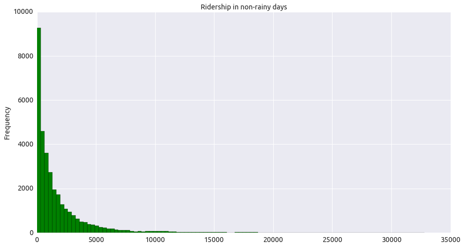
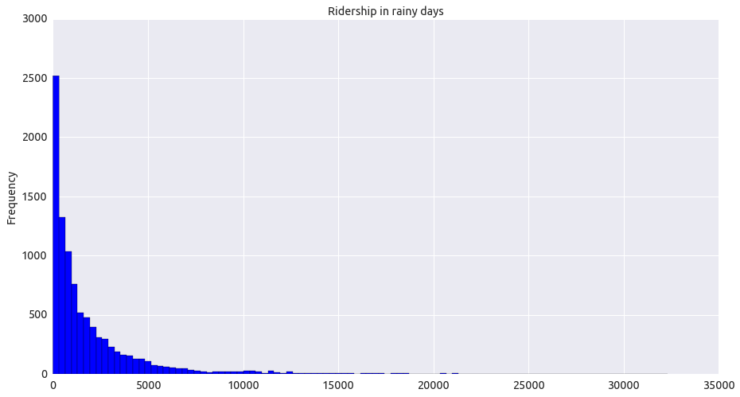
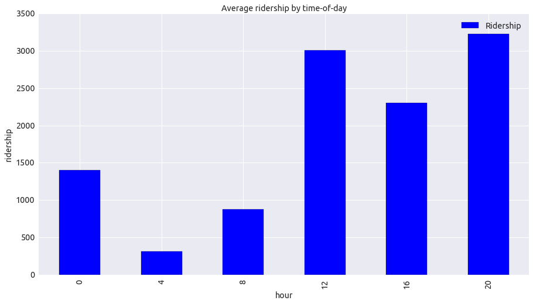
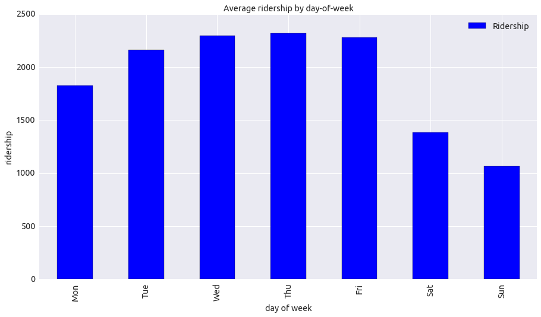
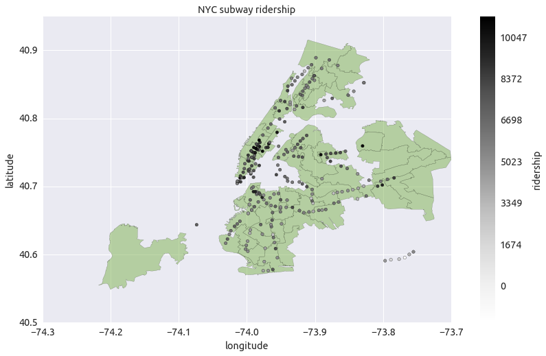

# Analyzing the NYC Subway Dataset

##   Section 1. Statistical Test
### 1.1. Which statistical test did you use to analyze the NYC subway data? Did you use a one-tail or a two-tail P value? What is the null hypothesis? What is your p-critical value?

- I used a **Mann-Whiteny U test** which is commonly used for compare two sets of data.
- I used **two-tailed test**, since I'm investigating weather affects subway ridership.
- The null hypothesis is **probabilily of riding in rainy and non-rainy days are equal**. We can decide rejection of the null hypothesis is against to alternative hypothesis.
    (mu_rain : probability of riding in rainy days, mu_norain : probability of riding in non-rainy days)
        - H0 : mu_rain = mu_norain
        - HA: mu_rain != mu_norain
- The p-value is **probability of obtaining a test statistics at least as extreme as ours if null hypothesis was true**. Therefore it is base value to reject hypothesis or retain it. For example, if p-value is smaller than p-critical value, we can reject the null hypothesis and choose alternative hypothesis.


### 1.2 Why is this statistical test applicable to the dataset? In particular, consider the assumptions that the test is making about the distribution of ridership in the two samples.

Ridership of rainy and non-rainy days is not normal distribution, and non rainy days ridership is larger than the other. So, I used Mann–Whitney U test.
> In statistics, the <a href="https://en.wikipedia.org/wiki/Mann%E2%80%93Whitney_U_test">Mann–Whitney U test</a> is a non-parametric test of the null hypothesis that two samples come from the same population against an alternative hypothesis, especially that a particular population tends to have larger values than the other. Unlike the t-test it does not require the assumption of normal distributions. It is nearly as efficient as the t-test on normal distributions.


```python
%pylab inline

params = {'legend.fontsize': 'x-large',
          'figure.figsize': (15, 8),
         'axes.labelsize': 'x-large',
         'axes.titlesize':'x-large',
         'xtick.labelsize':'x-large',
         'ytick.labelsize':'x-large',
         'font.family': 'Ubuntu'}
pylab.rcParams.update(params)
```

    Populating the interactive namespace from numpy and matplotlib


```python
import pandas as pd
import numpy as np
import scipy.stats
import seaborn as sns

# scipy.__version__ '0.16.1'
df = pd.read_csv('turnstile_weather_v2.csv')

norain_ridership = df[df['rain'] == 0]['ENTRIESn_hourly']
#norain_ridership = norain_ridership.apply(lambda x: (x - np.mean(x)) / (np.max(x) - np.min(x)))
norain_ridership_norm = (norain_ridership - norain_ridership.mean()) / (norain_ridership.max() - norain_ridership.min())
#norain_ridership_norm.plot.hist(alpha=0.5)

rain_ridership = df[df['rain'] == 1]['ENTRIESn_hourly']
rain_ridership_norm = (rain_ridership - rain_ridership.mean()) / (rain_ridership.max() - rain_ridership.min())

#rain_ridership_norm.plot.hist(alpha=0.5)
print scipy.stats.normaltest(rain_ridership)
print scipy.stats.normaltest(norain_ridership)
```

    NormaltestResult(statistic=7995.344777703629, pvalue=0.0)
    NormaltestResult(statistic=28009.076452936781, pvalue=0.0)


```python
byrain = df.groupby(['rain'])
byrain['rain'].aggregate([len])
```


<div>
<table border="1" class="dataframe">
  <thead>
    <tr style="text-align: right;">
      <th></th>
      <th>len</th>
    </tr>
    <tr>
      <th>rain</th>
      <th></th>
    </tr>
  </thead>
  <tbody>
    <tr>
      <th>0</th>
      <td>33064</td>
    </tr>
    <tr>
      <th>1</th>
      <td>9585</td>
    </tr>
  </tbody>
</table>
</div>


### 1.3 What results did you get from this statistical test? These should include the following numerical values: p-values, as well as the means for each of the two samples under test.


```python
byrain[ 'ENTRIESn_hourly','EXITSn_hourly' ].aggregate([np.mean])
```


<div>
<table border="1" class="dataframe">
  <thead>
    <tr>
      <th></th>
      <th>ENTRIESn_hourly</th>
      <th>EXITSn_hourly</th>
    </tr>
    <tr>
      <th></th>
      <th>mean</th>
      <th>mean</th>
    </tr>
    <tr>
      <th>rain</th>
      <th></th>
      <th></th>
    </tr>
  </thead>
  <tbody>
    <tr>
      <th>0</th>
      <td>1845.539439</td>
      <td>1333.111451</td>
    </tr>
    <tr>
      <th>1</th>
      <td>2028.196035</td>
      <td>1459.373918</td>
    </tr>
  </tbody>
</table>
</div>


```python
w, p = scipy.stats.mannwhitneyu(rain_ridership, norain_ridership)
print 'statistic:', w
print 'pvalue:', p
```

    statistic: 153635120.5
    pvalue: 2.74106957124e-06


### 1.4 What is the significance and interpretation of these results?

mannwhitneyu's p-value is one-sided, so double it for two-sided p-value. So, it would be 0.000005.

The p-value is smaller than 0.05, so ridership is affected when it is raining.

## Section 2. Linear Regression

### 2.1 What approach did you use to compute the coefficients theta and produce prediction for ENTRIESn_hourly in your regression model:
I used LinearRegression of Scikit Learn


### 2.2 What features (input variables) did you use in your model? Did you use any dummy variables as part of your features?

I used these features; rain, fog, precipi, meanprecipi.

I used UNIT, hour, weekday as dummy variables to get a better R^2 value. With dummy variables, each of the station is differently treated - each station is separated by unit, so that we can distinguish between the generally low-volume stations from the generally high-volume stations.


```python
dummy_units = pd.get_dummies(df['UNIT'], prefix='unit')
dummy_hours = pd.get_dummies(df['hour'], prefix='h')
dummy_weeks = pd.get_dummies(df['weekday'], prefix='w')
dummy_vars = dummy_units.join(dummy_hours).join(dummy_weeks)
dummy_vars.columns
```


    Index([u'unit_R003', u'unit_R004', u'unit_R005', u'unit_R006', u'unit_R007',
           u'unit_R008', u'unit_R009', u'unit_R011', u'unit_R012', u'unit_R013',
           ...
           u'unit_R459', u'unit_R464', u'h_0', u'h_4', u'h_8', u'h_12', u'h_16',
           u'h_20', u'w_0', u'w_1'],
          dtype='object', length=248)


### 2.3 Why did you select these features in your model? We are looking for specific reasons that lead you to believe that
> the selected features will contribute to the predictive power of your model.
Your reasons might be based on intuition. For example, response for fog might be: “I decided to use fog because I thought that when it is very foggy outside people might decide to use the subway more often.”
Your reasons might also be based on data exploration and experimentation, for example: “I used feature X because as soon as I included it in my model, it drastically improved my R2 value.”  

First, I tried to find out which weather condition is the most influential to subway ridership other than rain.
- rain, fog

If rain is more influential condition, I'm going to add these new features to improve my regression model.
- precipi, meanprecipi

### 2.4 What are the parameters (also known as "coefficients" or "weights") of the non-dummy features in your linear regression model?

- rain, fog

Rain has positive correlation to the ridership, however fog has negative correlation to the ridership. Then, I need to add precipi, meanprecipi, and dummy features to improve my model.


```python
from sklearn.linear_model import LinearRegression
target = df['ENTRIESn_hourly']

features_list1 = ['rain', 'fog']
features1 = df[ features_list1].join(dummy_vars)

clf1 = LinearRegression()
clf1.fit(features1, target)
pd.DataFrame(data = list(zip(features_list1, clf1.coef_)), columns=['Features', 'Coefficients'])
```


<div>
<table border="1" class="dataframe">
  <thead>
    <tr style="text-align: right;">
      <th></th>
      <th>Features</th>
      <th>Coefficients</th>
    </tr>
  </thead>
  <tbody>
    <tr>
      <th>0</th>
      <td>rain</td>
      <td>43.818628</td>
    </tr>
    <tr>
      <th>1</th>
      <td>fog</td>
      <td>-132.242928</td>
    </tr>
  </tbody>
</table>
</div>


- rain, precipi, meanprecipi

Meanprecipi has the strongest positive correlation to the ridership. 


```python
features_list2 = ['rain', 'precipi', 'meanprecipi']
features2 = df[features_list2].join(dummy_vars)

clf2 = LinearRegression()
clf2.fit(features2, target)
pd.DataFrame(data = list(zip(features_list2, clf2.coef_)), columns=['Features', 'Coefficients'])
```


<div>
<table border="1" class="dataframe">
  <thead>
    <tr style="text-align: right;">
      <th></th>
      <th>Features</th>
      <th>Coefficients</th>
    </tr>
  </thead>
  <tbody>
    <tr>
      <th>0</th>
      <td>rain</td>
      <td>23.790074</td>
    </tr>
    <tr>
      <th>1</th>
      <td>precipi</td>
      <td>-1820.146983</td>
    </tr>
    <tr>
      <th>2</th>
      <td>meanprecipi</td>
      <td>2671.828027</td>
    </tr>
  </tbody>
</table>
</div>


### 2.5 What is your model’s R2 (coefficients of determination) value?

- with rain, fog


```python
print clf1.score(features1, target)
```

    0.540728932668


- with rain, precipi, meanprecipi


```python
print clf2.score(features2, target)
```

    0.540891558431


### 2.6 What does this R2 value mean for the goodness of fit for your regression model? Do you think this linear model to predict ridership is appropriate for this dataset, given this R2  value?

If R^2 is closer to 1, the model is good.  
Given the R2 value 0.54, I think my linear model can predict ridership of NYC subway.

## Section 3. Visualization

Please include two visualizations that show the relationships between two or more variables in the NYC subway data.
Remember to add appropriate titles and axes labels to your plots. Also, please add a short description below each figure commenting on the key insights depicted in the figure.

### 3.1 One visualization should contain two histograms: one of  ENTRIESn_hourly for rainy days and one of ENTRIESn_hourly for non-rainy days.

As shown in these two graphs, ridership of rainy and non-rainy days is not normal distribution, and non rainy days ridership is larger than the other.


```python
norain_ridership.plot.hist(bins=100, color='g', title="Ridership in non-rainy days") #,ylim=[0,25000],
```


    <matplotlib.axes._subplots.AxesSubplot at 0x7ff7d9d9d250>





```python
rain_ridership.plot.hist(bins=100, color='b', title="Ridership in rainy days") #,ylim=[0,25000]
```


    <matplotlib.axes._subplots.AxesSubplot at 0x7ff7d9621c50>





### 3.2 One visualization can be more freeform. You should feel free to implement something that we discussed in class (e.g., scatter plots, line plots) or attempt to implement something more advanced if you'd like. Some suggestions are:
- Ridership by time-of-day

It was unexpected most people ride subway in the afternoon and evening, not in the morning.


```python
timeofday = df[['hour', 'ENTRIESn_hourly']]
bytimeofday = timeofday.groupby(['hour'])

ridership_tod =  bytimeofday['ENTRIESn_hourly'].aggregate([np.mean])
ridership_tod.columns = ['Ridership']
plot = ridership_tod.plot(kind='bar', title="Average ridership by time-of-day")
plot.set_xlabel('hour')
plot.set_ylabel('ridership')
```


    <matplotlib.text.Text at 0x7ff7c8051190>





- Ridership by day-of-week

People tend to ride subway on weekdays. Ridership is decreased on the weekend. People might use other transportation such as cars.


```python
dayofweek = df[['day_week', 'ENTRIESn_hourly']]
bytimeofday = dayofweek.groupby(['day_week'])
ridership_dow =  bytimeofday['ENTRIESn_hourly'].aggregate([np.mean])
ridership_dow.columns = ['Ridership']
ridership_dow.index = ['Mon', 'Tue', 'Wed', 'Thu', 'Fri', 'Sat', 'Sun']
plot = ridership_dow.plot(kind='bar', title="Average ridership by day-of-week")
plot.set_xlabel('day of week')
plot.set_ylabel('ridership')
```


    <matplotlib.text.Text at 0x7ff7bd06be90>





- NYC subway ridership on the map


```python
stations = df[['latitude', 'longitude', 'ENTRIESn_hourly', 'UNIT']]
bystations = stations.groupby(['latitude', 'longitude', 'UNIT'])
ridership_st =  bystations['ENTRIESn_hourly'].aggregate([np.mean])
ridership_st.columns = ['Ridership']
ridership_st.reset_index(level=['latitude', 'longitude', 'UNIT'], inplace=True)
```


```python
import matplotlib.pyplot as plt 
from descartes import PolygonPatch
import math
import json

data = []
with open('nyad_16b/nyad.json') as json_file:
    json_data = json.load(json_file)
BLUE = '#80B352'
DBLUE = '#192310'
fig = plt.figure() 

for feature in  json_data['features']:
    poly = feature['geometry']
    if poly['type'] != 'Polygon':
        continue
    ax = fig.gca() 
    ax.add_patch(PolygonPatch(poly, fc=BLUE, ec=DBLUE, alpha=0.5, zorder=3 ))
    ax.axis('scaled')
    
z = ridership_st['Ridership']
scp = plt.scatter(ridership_st['longitude'], ridership_st['latitude'], c=log(z), zorder=4)
print type(scp)


m0=int(np.floor(z.min()))            # colorbar min value
m6=int(np.ceil(z.max()))             # colorbar max value
m1=int(1*(m6-m0)/6.0 + m0)               # colorbar mid value 1
m2=int(2*(m6-m0)/6.0 + m0)               # colorbar mid value 2
m3=int(3*(m6-m0)/6.0 + m0)               # colorbar mid value 3
m4=int(4*(m6-m0)/6.0 + m0)               # colorbar mid value 4
m5=int(5*(m6-m0)/6.0 + m0)               # colorbar mid value 5
cbar = plt.colorbar()

cbar.ax.set_yticklabels([m0,m1,m2,m3,m4, m5, m6])
cbar.ax.set_ylabel('ridership')


plt.xlabel('longitude')
plt.ylabel('latitude')
plt.title('NYC subway ridership')
plt.show()
```

    <class 'matplotlib.collections.PathCollection'>





## Section 4. Conclusion

### 4.1 From your analysis and interpretation of the data, do more people ride the NYC subway when it is raining or when it is not raining?  

I am sure that people ride the NYC subway when it is raining. Because results of statistical test is clear. The p-value is smaller than 0.05, so ridership is affected when it is raining.


### 4.2 What analyses lead you to this conclusion? You should use results from both your statistical tests and your linear regression to support your analysis.

First, I can reject null hypothesis by Mann–Whitney U test, so I'm sure that probabilities of riding in rainy and non-rainy days are different. 

Second, I applied linear regression with the features: rain, precipi, meanprecipi, and dummy variables. Among my features, meanprecipi is the strongest positive coefficients, rain is also positive coefficients - more rain lead to more passengers. I got 0.54 R^2 value, which means 54% of total variation in ENTRIESn_hourly can be explained by my linear regression model, and the other 46% of total variation in ENTRIESn_hourly remains unexplained.

Therefore, there seems little tendency for people to ride subway when it is raining.

## Section 5. Reflection

### 5.1 Please discuss potential shortcomings of the methods of your analysis, including: Dataset, Analysis, such as the linear regression model or statistical test.

Hourly ridership and daily rain record show different granularity. I think hourly rain records can increase accuracy in analysis with rainfall records. In addition, dataset only contains ridership in May. For accuracy in statistics and model of ridership, datasets of whole year is necessary.
In the linear regression, my model might be fallen into local optima, which means model can be improved by adjusting features and steps. However, I should consider carefully because adjusting the factors increases calculation time.

### 5.2 (Optional) Do you have any other insight about the dataset that you would like to share with us?

As far as the dataset shows, ridership is increased in afternoon and evening. I think this is because New York is a city of massive commuters. 

## Section 6. References

- Mann–Whitney U test: https://en.wikipedia.org/wiki/Mann%E2%80%93Whitney_U_test
- Visualizing GeoJSON in 15 minutes: http://geographika.co.uk/visualising-geojson-in-15-minutes
- NYC State Assembly Districts (Clipped to Shoreline): http://www1.nyc.gov/site/planning/data-maps/open-data/districts-download-metadata.page
- pylab colorbar example: http://matplotlib.org/examples/pylab_examples/contourf_demo.html
- pylab scatter example: http://matplotlib.org/examples/pylab_examples/scatter_star_poly.html
- pandas.get_dummies: http://pandas.pydata.org/pandas-docs/stable/generated/pandas.get_dummies.html
